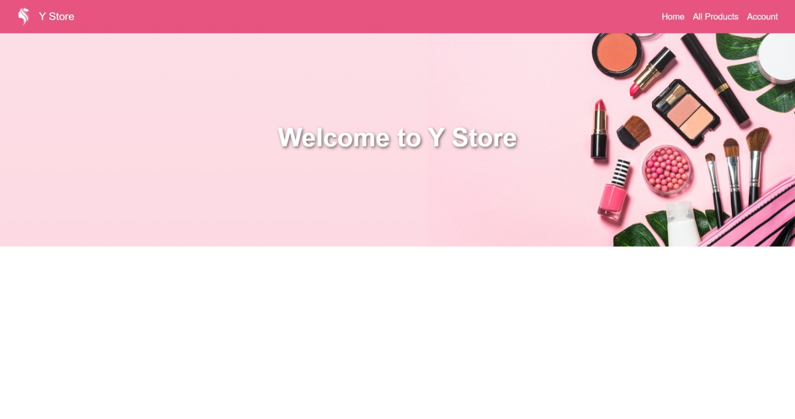
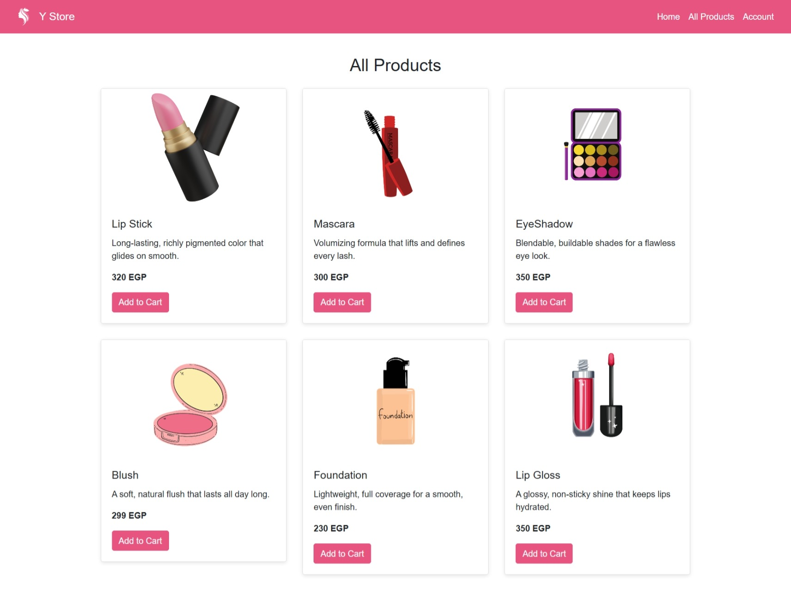
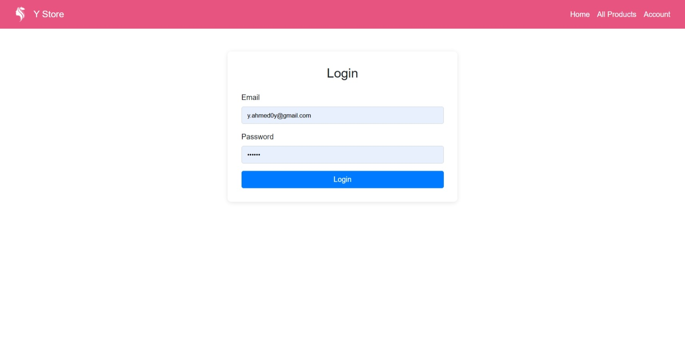
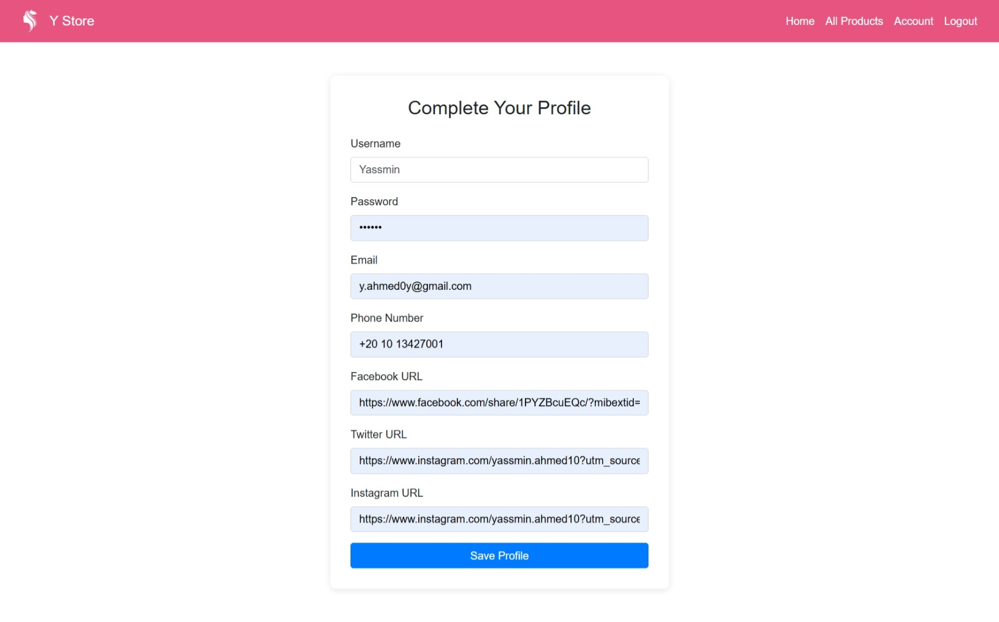

# PHP Assignment 2 - Y Store Makeup E-commerce Website
---

### Home Page
Displays the store landing page with:
- Responsive navigation bar
- Store logo
- Header section with background image
- Welcome message

---

### All Products Page
Displays makeup products using Bootstrap cards.

Features:
- 6 makeup products
- Products generated dynamically using PHP associative array
- Uses `foreach` loop to display products

---

### Account Page - Login
Displays login form when the user is not logged in.

Features:
- Email input
- Password input
- Input validation
- Stores user data using PHP sessions
- Redirects to All Products page after login

---

### Account Page - Complete Profile
Displays profile completion form when the user is already logged in.

Fields include:
- Username
- Password
- Email
- Phone
- Facebook
- Twitter
- Instagram

Features:
- Validates all inputs
- Stores information in session
- Redirects to Home page after completion

---

### Logout
Destroys the current user session and redirects back to the Home page.

---
